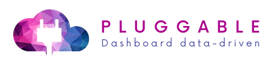

# Under Construction. Collaborate!

## Plugable Dashboard Api

#### Roadmap

- Forms
    - [ ] form wizard component
    - [ ] dont submit field option
    - [ ] input methods predefined (lodash features)
  
 - Form Types
    - [X] Switch || type=switch
    - [X] Code || type=code
    - [X] Json || type=json
    - [x] Image Preview || type=image 
    - [X] File Upload
    - [X] Select Dynamic remote options | type=dynamicSelect (multiple=true)
    - [X] List Array (tags) || type=tags
    - [X] Subgrid array ||  type=grid + api.bypassGetData
    - [X] Sub object field  || type=object options=[ {chidrean schema} ]
    - [ ] 1:1 Nested forms || type=object + api.rootApi url
    - [X] 1:N Nested grid || type=grid + api.rootApi url 	 
    - [ ] location input component
    - [ ] autocomplete remote search
    - [ ] modal grid search input


- Grid
	- [X] Pagination
	- [ ] grid actions (on change select, buttons to flows)
	- Mask || vfeMask: "+33 \\02 00 00 00 00 00"
	
- Grid types
  - [X] Image zoom
  - [ ] link
  - [X] Switch
  - [X] Array
  - [X] Select
  - [X] HTML 
  - [X] Sub object fields
  - [X] Interpolate Expression
  - [ ] Grid Card Preview
	
- features
	- [ ] form submit hooks (flows)
	- [ ] filemanager grid
	- [X] project widgets 
	- [ ] dashboard flows ( schema i/o data subsequent)
	- [ ] Cache schema

## SECURITY ALERT

Don't use this dashboard online, or if you use, protect folder by password access. Pluggable dashboard its designed to use with ElectronJS, locally and safe from  web attacks.

### Installation

#### Clone repo

``` bash
# clone the repo

# go into app's directory

# install app's dependencies
$ npm install
```

#### Dashboard Config

To configure dashboard fill the .env and build vue (You can clone .env.example to .env)
```
VUE_APP_ENV=local
VUE_APP_DATABASE=/models/projects.json			// Projects json file path/url | default /public/models/projects.json

VUE_APP_LOGIN=true  | true/false
// Required if login true
VUE_APP_LOGIN_URL=https://project.com/auth/login	// Dashboard Login auth url
VUE_APP_LOGIN_USER_FIELD=email              // Username field
VUE_APP_LOGIN_PASS_FIELD=password           // Password field
VUE_APP_LOGIN_TOKEN_PATH=token              // Response token path in data object
VUE_APP_LOGIN_TOKEN_HEADER=access-token			// Request token header JWT 
VUE_APP_LOGGED_URL=https://project.com/auth/logged	// Get logged user data url
```

#### Usage

``` bash
# serve with hot reload at localhost:8080
npm run serve

# build for production with minification
npm run build

# run linter
npm run lint

# run unit tests
npm run test:unit

# run e2e tests
npm run test:e2e

```

## Projects Api

Project file contains tenants and schemas of apis to be consumed. Dashboard project json by default is located in /public/models/ folder.

```
[
  {
	  //required | Project config
	  "code": "modelslug",
	  "name": "Model Label",
	  "url": "https://project-url.com",
	  "resources_path": "/models/",       //Base path or base URL of Json Models folder
	  "resources": {
		// Project crud endpoints schema
		"users": {
		  "resource": "users_schema.json",
		  "label": "Users"
		},
		"roles":{
		  "resource": "roles_schema.json",
		  "label": "Roles"
		}
	  },
	  // optional | Project authentication api
	  "auth": {
		"url_login": "https://project-url.com/api/user",	// Url of login api
		"url_method": "post",                     // Login http method  | Default POST
		"field_username": "user_id",              // Username field to be send | Defaut email
		"field_secret": "access_token",           // Password/Secret field  | Default password
		"field_remember": "remember",             // Remember field to permanent login (if exists) | Default remember
		"response_mode": "body",                  // How to get token string | opts: body/header | Default body
		"response_token": "token",                // Response data token location (ex: {user:{token: '...'}} means user.token) | Default 'token'
		"request_mode": "header",                 // How to send token between requests | opts: header/query | Default header
		"request_token": "access-token",					// Token field name | Default access-token
		"request_token_expression": "Bearer {token}",		// Token request value expression to be interpolated | Default {token}		
		"logged_url": "https://project-url.com/api/user",	// Url to How to get logged user data  
		"logged_model": {                         // User response DTO
		  "id": "_id",                            // Ex: { id: 1, fullname: 'John doe', email: 'email@email.com', level: 'admin' }
		  "name": "fullname",
		  "username": "email",
		  "role": "level"
		}
	  },
	}
]
```

## Basic CRUD Schema (see advanced docs running dash > docs)
```
{
  "type": "object",
  "title": "Users",         // Schema title visible to user
  "domain": "users",				// Schema slug visible on url
  "properties": [
    {                       // VueFormulate / Grid table schema
      "name": "id",					// Data object index
      "label": "ID"					// Visible label
	  "config":{					// Table grid config
		"grid": true,				// Visible in grid
        "sort": 0					// Sort order in grid
	  }                     // Docs link: https://vueformulate.com/guide/inputs/
    },
    {
      "name": "name",
      "label": "Name",
      "config": {
        "grid": true,
      }
    }, 
	{
	  "name": "bio",
	  "label": "About me",
	  "type": "textarea"
	}
  ],
  "api": {                          // Crud endpoint config
    "rootApi": "https://project.com/users", // Endpoint base url 
	// Optional
    "wrapData": "rows",						  // Response object array data field (ex: { rows: [...] } means 'rows')
    "totalData": "count",					  // Count data field | if not exists used data.length by default
    "pagination": {                 // Query string settings
      "pageField": "page",					// pagination field
      "limitField": "limit",				// Data count limit field  
      "sortField": "order",					// Sort field
      "sortExp": "{sort}",					// Sort expression data to be interpolated (ex: '{prop},{sort}' means 'sort=id,desc'
      "filterField": "filter",      // Filter field
      "filterExp": "{prop},like,%{value}%"	// Field expression value
    },
    "params": {                     // Fixed query string params
      "limit": 15,
      "ga": "123-1224"
    },
	"headers":{                       // Fixed headers params
		"app-key": "qwertyuiop-asdfghjkls"
	}
  }
}
``` 
 
### Libs
- Lodash
- Moment
- axios
- quill
- prismjs
- jsoneditor
- https://github.com/RasCarlito/axios-cache-adapter
  
